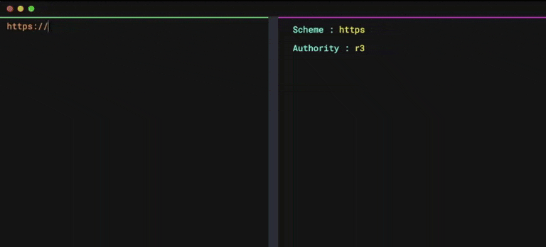

# Prettifier

<p align="center">

</p>

<p align="center">

</p>
Prettier is a Multipurpose Modern prettier. Prettifier can be useful in analysing large URL's (Uniform Resource Locator) that pass back and forth between server with very ease.

Prettifier is completely written in `VUE JS`

<p align="center"></p>

# Live Preview

To get a live preview [`Click here`](https://himanshu12345yadav.github.io/Prettifier)

# Usage

Put the long URL which you want to beautify in the left half of the editor and get the parsed and beautified result to the right half of the editor

# Installation

To install `prettifier` run the following commands in terminal or command prompt

Make sure that `node.js` is installed in your system

```bash
npm install --production
```

# Run on Localhost

To run Prettiefier on localhost

```bash
npm run serve
```

This will start a development server on port `8080`. Open your browser and search `localhost:8080`

You will see any lint errors or console errors as you edit

`Happy Hacking!`
